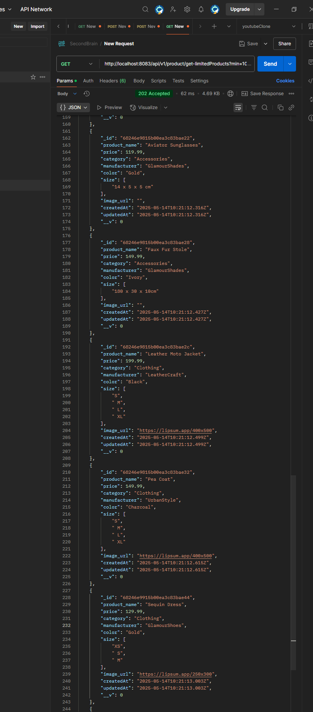
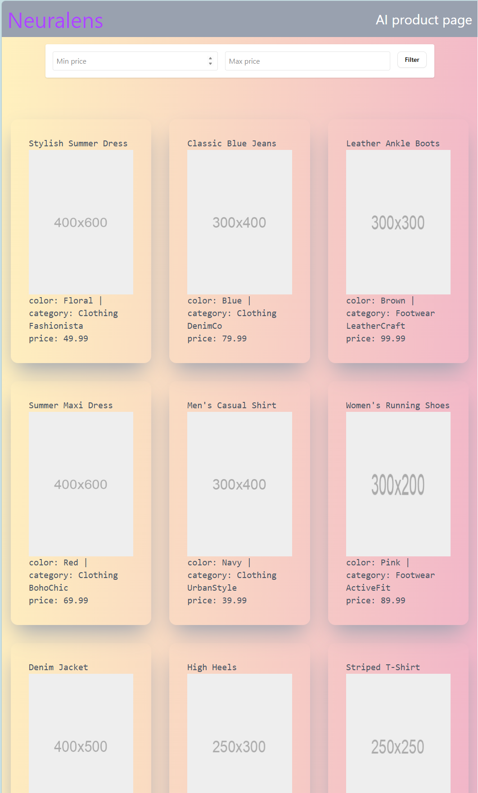

# Neuralens AI Project

This README outlines the technologies used to build the Neuralens AI Project, detailing both backend and frontend components.

## Backend

**Technologies:**

- **TypeScript:** Provides improved type safety and maintainability compared to plain JavaScript.
- **MongoDB & Mongoose:** Data is stored in a MongoDB database. Mongoose simplifies schema management and data operations.

- **xlsx Library:** Converts Excel (xlsx) files to JSON format for efficient data storage and retrieval.

  - I created a importData function in **utils/importData** which is used for importing the data in mongodb.

  - showing the function for importing the data
    []

  - pushing data from xls intp mongodb
    ()

  - screenshot of database containing the data
    

  - working postman request for filter based on price
    

  - if you want to put some new data in data base just put he file in **./backend/dist/data** keep the name of the file as **demo_data.xls** and then un comment the **importData()** statment in **backend/src/index.ts** folder

## Frontend

**Pages:**

- **Landing page** I visited neuralens Ai website so I sorted followed them of company page
  

- **product page** page where all product is shown
  
  **Technologies:**

- **React & Vite:** The app is built with React and bundled using Vite, offering a faster and more optimized development experience than Create React App.
- **TypeScript:** Ensures type safety and helps catch errors during development.
- **Tailwind CSS:** Used for responsive and efficient styling of the application.

- **Shadcn & accernity** these ui library are used for landing page effect and buttons just to show that I am comfortable with these library

## Project Note

This project was developed without AI assistance for creating the web application, showcasing a range of modern web development skills.
